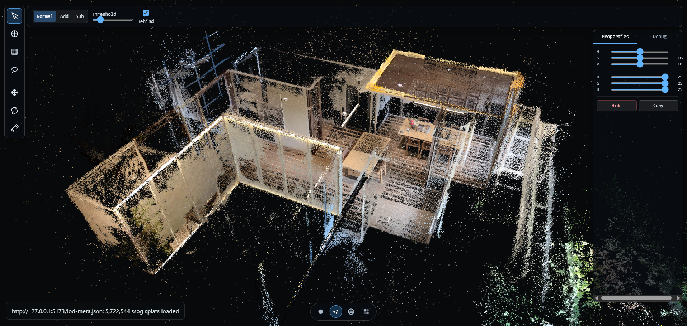
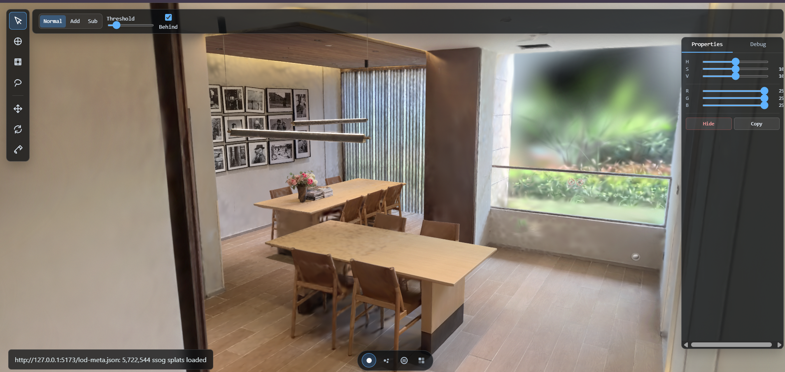

# SplatShop

A **WebGPU-first** Gaussian splat viewer built with [Babylon.js](https://www.babylonjs.com/). Uses `@playcanvas/splat-transform` for file parsing.

> **Note:** This project is a work in progress. Selection and editing tools are UI-only (not yet implemented). It currently functions as a viewer.



## Features

- **Gaussian splat rendering** — Full 3D Gaussian EWA projection via instanced quads
- **WebGPU compute pipeline** — GPU-accelerated depth sorting, tile binning, and radix sort
- **WebGL fallback** — Automatic fallback when WebGPU is unavailable
- **Multiple file formats** — `.ply`, `.splat`, `.spz`, `.ksplat`, `.sog` (packed), `.ssog` (streamable)
- **LOD streaming** — Hierarchical spatial LOD with on-demand chunk loading for SSOG
- **GPU selection pass** — Nearest-splat picking and color-similarity selection via compute shaders (WIP, not wired to UI)
- **Selection & editing tools** — Point, circle, marquee, lasso, move, rotate, paint brush (UI-only, not yet functional)
- **Visualization modes** — Normal, particle cloud, chunk color, color group
- **Post-processing** — Vignette + warm color lift with time-pulsing effect
- **Debug overlays** — FPS, splat counts, tile heatmaps, GPU sort stats



## Tech Stack

| Layer | Technology |
|-------|-----------|
| Engine | [Babylon.js](https://www.babylonjs.com/) 8.20 |
| Rendering | WebGPU (primary) / WebGL 2 (fallback) |
| Language | TypeScript 6 |
| Bundler | Vite 7 |
| Splat parsing | [@playcanvas/splat-transform](https://github.com/playcanvas/splat-transform) 2.3 |
| Compute sort | Custom GPU radix sort + CPU worker fallback |

## Getting Started

### Prerequisites

- Node.js >= 20.19.0

### Install

```bash
npm install
```

### Development

```bash
npm run dev
```

Opens at `http://127.0.0.1:5173`.

### Build

```bash
npm run build
```

Output goes to `dist/`.

### Preview production build

```bash
npm run preview
```

## Usage

### Loading splats

| Method | Description |
|--------|-------------|
| **Drag & drop** | Drop `.ply`, `.splat`, `.spz`, `.ksplat`, `.sog`, or `lod-meta.json` files onto the viewport |
| **File picker** | Click the file icon on the left toolbar |
| **URL query** | Navigate to `?url=<path-to-file>` |
| **Built-in demos** | Files in `public/` are served at `/?url=Room.sog` |
| **Sample scene** | Download from [superspl.at/scene/9d370db9](https://superspl.at/scene/9d370db9) — "Reading Room" by ethan3111 |

### Tools

The left toolbar has selection and editing tool icons, but these are **not yet functional** — the tools are UI-only scaffolding. The app currently works as a read-only viewer with orbit/pan/zoom controls.

### Controls

- **Orbit** — Left-click drag
- **Pan** — Right-click drag / middle-click drag
- **Zoom** — Scroll wheel
- **Frame selection** — Double-click

### Query parameters

| Param | Values | Default | Description |
|-------|--------|---------|-------------|
| `?url=` | Path | — | Load a splat file on startup |
| `?up=` | `0,1,0` | `0,1,0` | Up vector |
| `?renderer=` | `auto`, `cpu`, `gpu`, `compute` | `auto` | Render backend |
| `?gpuSort=` | `off`, `shadow`, `active`, `coarse` | `active` | GPU sort mode |
| `?quality=` | `fast`, `balanced`, `full` | `balanced` | LOD quality preset |
| `?splatBudget=` | Number | `500000` | Max visible splats |

## Project Structure

```
src/
  main.ts              Entry point
  styles.css           Global styles (dark theme)
  asset-loader.ts      Asset loading orchestration
  file-handler.ts      File import (drag-drop, file picker)
  app/
    createApp.ts       App bootstrap (engine, scene, camera, UI)
    createUI.ts        DOM-based UI (toolbars, panels, viz bar)
  splat/
    SplatCloud.ts      Central runtime orchestrator
    SplatAsset.ts      Asset type definitions
    SplatData.ts       Columnar splat data (Float32Array)
    SplatBuffers.ts    GPU buffers for expanded splats
    SogBuffers.ts      GPU buffers for packed SOG splats
    SplatLodManager.ts LOD selection for expanded splats
    SogLodManager.ts   LOD selection for SOG splats
    SsogLodSelector.ts Spatial LOD for SSOG
    SelectionPass.ts   GPU compute selection (nearest + color)
  rendering/
    createEngine.ts    Engine creation (WebGPU/WebGL)
    SplatRenderPass.ts    Raster pass for expanded splats
    PackedSogRenderPass.ts Raster pass for packed SOG
    CompositeSplatRenderPass.ts Multi-chunk SSOG
    StreamingSsogRenderPass.ts  Streaming SSOG
    GpuDepthKeyPass.ts .. Compute sort chain
    GpuRadixSortPass.ts Full GPU radix sort
    ComputeTileStatsPass.ts .. Tile-based compute passes
  io/
    loader.ts          Unified splat loader
    file-systems.ts    File system abstractions (blob, URL)
  debug/
    ViewerDebugStats.ts FPS, stats, overlays
    LoadingProgress.ts  Loading progress bar
  workers/
    splatSort.worker.ts CPU sort worker (fallback)
```

## License

MIT
